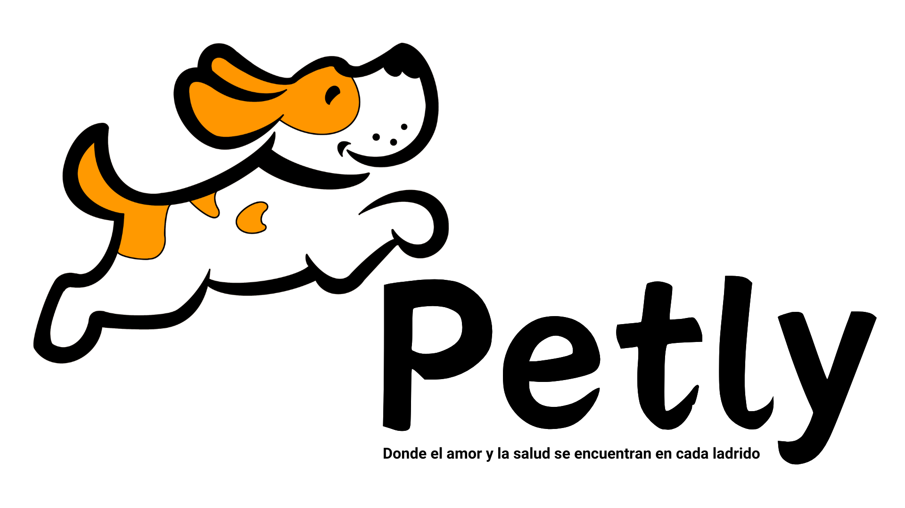

### Bienvenido a Petly 🐶

Somos una clínica veterinaria especializada en el cuidado exclusivo de perros, donde nos dedicamos con pasión al bienestar de tu mascota. En este repositorio, te brindamos acceso al código de nuestra página web, diseñada para que puedas acceder fácilmente a toda la información relacionada con la salud y cuidado de tu fiel compañero canino. Además, nuestra plataforma facilitará la comunicación con nuestro equipo de expertos veterinarios. ¡Confía en Petly para proporcionar el mejor cuidado a tu mascota! 🐾

### Información del proyecto 📋

Nuestro proyecto consiste en desarrollar una página web que sirva como plataforma integral para la gestión de información de nuestras mascotas, clientes y personal veterinario. Con esta herramienta, los propietarios de perros podrán acceder fácilmente al estado de salud de sus mascotas, programar citas, y recibir actualizaciones sobre los tratamientos y cuidados médicos que se les proporcionan. Además, nuestro equipo de veterinarios podrá registrar y gestionar eficientemente las atenciones médicas, tratamientos y seguimientos de cada perro hospitalizado. 

### ¿Quienes somos? 🤖

Somos un equipo de estudiantes de la Universidad Javeriana, apasionados por el desarrollo web y comprometidos con aplicar nuestros conocimientos en la creación de este proyecto. Conoce al equipo que está detrás de Petly: [Hermann Hernández](https://github.com/Hermann103), [Nicolás Rincón](https://github.com/Rinconjr) y [Alejandro Suárez](https://github.com/suaracost).

